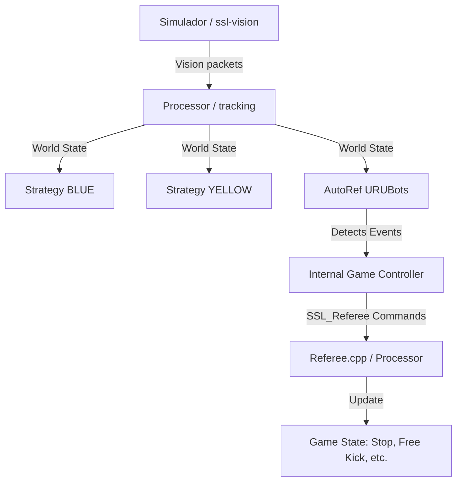

# 🤖 Ra Simulator SSL - URUBots Edition

[](https://github.com/Facufgdz/Ra-Simulator-SSL)
[](https://www.gnu.org/licenses/gpl-3.0)

Welcome to the **Ra Simulator SSL**, a high-performance framework for Simulating Small Size League (SSL) games. This version has been enhanced by the **URUBots** team with a fully restored and functional **AutoRef** system.

---

## 🌟 Overview

The Ra Simulator is the cornerstone of SSL development, offering a complete environment for:
*   **Real-time Simulation**: Physics-accurate SSL games with variable robot counts and field sizes.
*   **Dual Control Modes**: Control robots autonomously using TypeScript/Lua AI scripts or take manual control.
*   **Log Management**: Create, playback, and analyze game recordings for strategy refinement.
*   **AutoRef Integration**: Automatic detection of game events following RoboCup SSL rules.

---

## 🏗️ Architecture

The simulator operates on a multi-layer architecture that separates vision processing, strategy logic, and refereeing.



### Core Components
1.  **Ra & Horus**: Graphical interface for simulation control and log playback.
2.  **Simulator CLI**: Lightweight physics engine for headless environments.
3.  **AutoRef (Restored!)**: Specialized logic for automatic rule enforcement.
4.  **Amun-CLI**: Command-line interface to run AI scripts directly.

---

## ⚖️ AutoRef: The AI Referee

### What's New?
Previously, the AutoRef module was a submodule that lacked proper integration and functionality. We have **completely restored and enabled** it using the new `init.ts` script. 

**Key improvements include:**
-   **Full Installation Pipeline**: Automated setup via `install-autoref.sh`.
-   **Seamless Enablement**: Direct integration within the Ra interface.
-   **Event Logic**: Accurate detection for modern SSL rules.

### Implemented Events
| Event | Type | Description |
| :--- | :--- | :--- |
| **Lateral** | `BALL_LEFT_FIELD_TOUCH_LINE` | Ball leaves the field through touch lines. |
| **Goali/Corner** | `BALL_LEFT_FIELD_GOAL_LINE` | Ball leaves through goal lines (not a goal). |
| **Goal** | `POSSIBLE_GOAL` | Accurate goal detection and validation. |
| **Double Touch** | `ATTACKER_DOUBLE_TOUCHED_BALL` | Prevents multiple touches during free kicks. |
| **Distance Rule** | `DEFENDER_TOO_CLOSE` | Ensures 0.5m distance during free kicks. |
| **Timeouts** | `FREE_KICK_TIMEOUT` | Monitored 5s (Div A) or 10s (Div B) limits. |

---

## 🚀 Getting Started

### 1. Installation
The AutoRef system requires a specific TypeScript build environment. We've simplified this with an automation script:

```bash
cd strategy/typescript
./install-autoref.sh
```

*This will install dependencies via `npm` and build the TypeScript project.*

### 2. Manual Setup (Optional)
If you prefer manual steps:
1.  `cd strategy/typescript && npm install`
2.  `npm run build`

### 3. Usage in Ra
To activate the simulation with AutoRef:
1.  Launch **Ra**.
2.  Navigate to the **AutoRef Tab** (Third strategy slot).
3.  Load the file: `strategy/typescript/autoref/init.ts`.
4.  Entry point: `AutoRef`.
5.  **Enable Configuration**:
    *   ☑️ `Use Internal Referee`
    *   ☑️ `Use Internal AutoRef`
    *   ☑️ `Internal Game Controller`

---

## 🛠️ Developer Guide: Improving AutoRef

The AutoRef is built on a modular TypeScript structure located in `strategy/typescript/autoref/init.ts`. To add new features or improve detection:

1.  **Modify `init.ts`**: The core logic resides in `autoRefMain()`.
2.  **Tracking**: Use `updateLastTouch()` to refine ball possession logic.
3.  **New Events**: Send events to the Game Controller using `sendGameEvent(pb.gameController.GameEvent)`.

### Path to v2.0
We are currently working on implementing:
- [ ] `BOT_TOO_FAST_IN_STOP`: Speed monitoring during stop states.
- [ ] `DEFENDER_IN_DEFENSE_AREA`: Penalty area violation detection.
- [ ] `BOT_CRASH_UNIQUE`: Advanced robot collision detection.
- [ ] `KEEPER_HELD_BALL`: Goalkeeper time limit tracking.

---

## 📄 License
This project is licensed under the GPL-3.0 License - see the [COPYING](COPYING) file for details.

Developed with ❤️ by **URUBots**.
